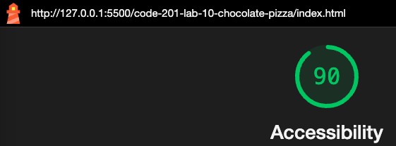

# LAB - 10

## Chocolate Pizza

I build a web application with the purpose of building out a single webpage based on the provided design comp assets. The goal was to make it as similar to the preview as possible, which I achieved with CSS and HTML.

### Author: Rhett Chase

### Links and Resources

- [submission PR](https://github.com/rhettchase/code-201-lab-10-chocolate-pizza)
- [web.dev FlexBox](https://web.dev/learn/css/flexbox/)
- [Stack Overflow](https://stackoverflow.com/questions/37990812/css-background-stripes-on-div)
- ChatGPT

### Lighthouse Accessibility Report Score



### Reflections and Comments

- This lab was a great lesson in `specificity` since it required multiple layers of styling on different sections of the page and some styling could potentially override others to create unexpected results
- I used `flex-box` multiple times to get items to sit either in-line or on top of each other
- I used `relative positioning` and absolute positioning to achieve the effect of getting the list to sit on top of the notepad image

```css
.left-list {
  position: absolute;
  top: 10%;
  left: 10%;
  transform: translate(-10%, -10%);
}

.right-list {
  position: absolute;
  top: 10%;
  left: 50%;
  transform: translate(-10%, -10%);
}
```